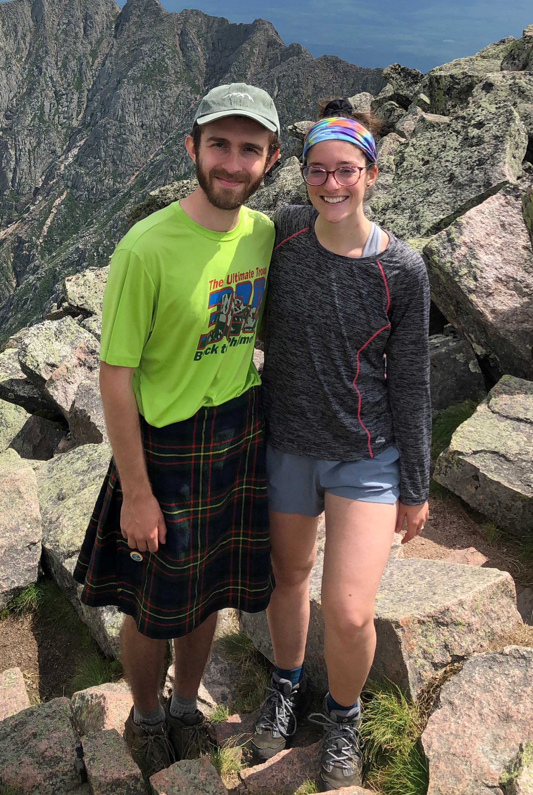

Created by Robert Elliott initially for an R class in Fall of 2021.

I'm a second year Masters student at the University of New Hampshire. My project is a combination of bioinformatics and wetlab biochemistry to investigate the role of palmitoylation in regulating plant senescence. 

My academic interests include various areas of biochemistry, mathematics, and the intersection of both. 

{width=50%}