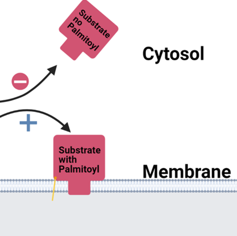

```{r setup, include=FALSE}
library(readxl)
library(ggplot2)
library(knitr)
library(gprofiler2)
library(dplyr)
genes <- read_excel("acylRACtotaldataset.xlsx")
colnames(genes)[9] <- "TMH"
goterms <- read.delim2("ATH_GO_GOSLIM.txt", header = FALSE)

```

# Data analysis and Final Project for Data Science for Life Sciences (Fall2021).
### Background of Palmitoylation
The data analyzed here comes from an acyl-RAC experiment performed on *Arabidopsis thaliana*, a plant model organism. Acyl-RAC, or acyl-resin assisted capture, is a protein purification method that captures S-acylated proteins. S-acylation, or palmitoylation, is a form of post-translational modification where a 16 carbon fatty acid, palmitate, is attached to a surface exposed serine residue. Because palmitate is significantly hydrophobic, this pushes the protein to favor attachment to a lipid membrane, with the palmitate group inserted into the lipid layer. 



Here, the authors identified 5262 unique palmitoylated proteins. Further, 12,419 modified cysteines were identified in those proteins. 


### Some Tables to Illustrate the Data


Below is a table of predicted subcellular locations and the number of genes from the dataset that are predicted to occupy them. These locations are determined using SUBAcon, the SUBcellular Arabidopsis consensus algorithm. At the bottom, some proteins are predicted to have more than one location; though the significant majority of them occupy a single location in the cell. Nine of these proteins have no prediction noted. 
```{r echo=FALSE}
#list number of proteins per cellular location
#new dataframe with unique subacon and number of genes associated with them
#way to remove number of rows?
df <- data.frame(matrix(ncol = 2, nrow = 0))
colnames(df) <- c('Subcellular Location', 'Proteins Counts')
for (cell_location in unique(genes$SubaCon)){
  locations <- subset(genes, genes$SubaCon == cell_location) #subset dataframe of cellular location and genes in that location.
  gene_count <- nrow(locations)
  df[nrow(df) + 1,] = c(cell_location, gene_count)
}
kable(df, caption = "Table of Subcellular Protein locations as determined by SUBAcon")
```

Next, proteins are organized according the MapMan bin they associated with. Similar to Gene Ontology terms, MapMan bins are a structured hierarchy of biological concepts originally developed specifically for *Arabidopsis*. Intensive studies have been done to compare the use of MapMan vs GO terms and found that it largely came down to a problem-specific condition.

The most interesting part is that of the 5262 proteins, 1678 of them are not assigned to any MapMan bin.
```{r echo=FALSE}
#MapMin code 1. Range of codes 0-50


df2 <- data.frame(matrix(ncol = 2, nrow = 0))
colnames(df2) <- c('MapMan description', 'Proteins counts')
for (code in unique(genes$`MapMan Bin1 Desc`)){
  process <- subset(genes, genes$`MapMan Bin1 Desc` == code) #subset dataframe of cellular location and genes in that location.
  gene_count <- nrow(process)
  df2[nrow(df2) + 1,] = c(code, gene_count)
  
}

kable(df2, caption = "Table of MapMan descriptors and Associated Protein Counts")

```

### Heading to the Bar (graphs)

```{r echo=FALSE, fig.cap="Number of Predicted Transmembrane Helices of Acylated Proteins"}

ggplot(data=genes, aes(x=TMH)) + geom_bar() + geom_text(aes(label = ..count..), stat= 'count', vjust = -0.5) 

```

The above graph illustrates an important aspect of palmitoylation and membrane association. Transmembrane helices(TMH) are naturally occurring structures that favor insertion into lipid membranes and as such can become membrane associated without palmitoylation. The more TMH present in a protein, the strong the association to the point where some proteins do not assume their active conformation until they've inserted into a membrane. We see above that the overwhelming majority of proteins have no TMH, and would thus require palmitoylation in order to become membrane associated. 


```{r echo=FALSE, fig.cap="Number of Predicted Transmembrane Helices of Acylated Proteins excluding those with No or only 1 TMH"}
notmh <- subset(genes, genes$TMH != 'NA')
nottmhor1 <- subset(notmh, notmh$TMH != 1)
#need to make a subset of the data wihtout entries where TMH = NA and use that for the below instead
ggplot(data=nottmhor1, aes(x=TMH, fill = SubaCon)) + geom_bar(show.legend = FALSE) + geom_text(aes(label = ..count..), stat= 'count') 

```


### GO term analysis

###### Bibliography Here